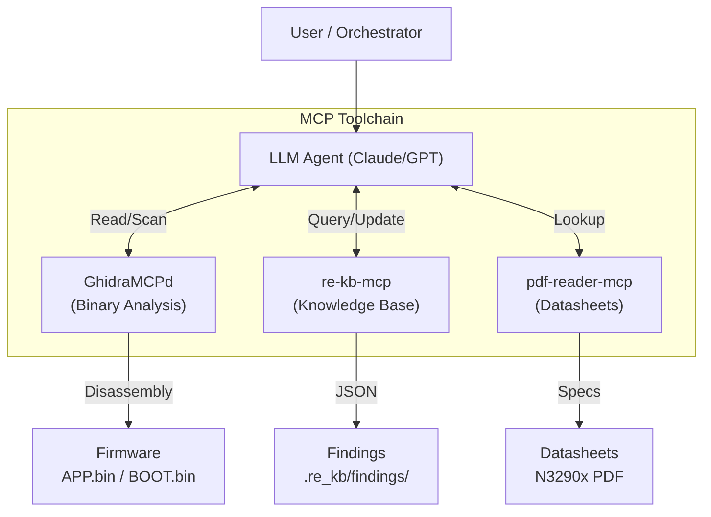

# Analysis Architecture & Workflow

This project utilizes a unique "Cyborg" workflow, combining manual reverse engineering with AI agents via the **Model Context Protocol (MCP)**.

## The Triad System

Instead of simply asking an LLM to "analyze this file," we expose specific tools that allow the agent to query the binary and the knowledge base deterministically.

### 1. GhidraMCPd (The Eyes)
A headless Ghidra bridge that allows the agent to:
*   `search_scalars_with_context`: Find where specific constants (like MMIO addresses) are used.
*   `disassemble_at`: Read assembly logic at specific addresses.
*   `read_strings`: Extract text references.

### 2. re-kb-mcp (The Memory)
A structured JSON database that stores "Facts" vs "Hypotheses".
*   Prevents hallucination by requiring `status="verified"` and `evidence=[]`.
*   Resolves contradictions (e.g., the "K5DN vs U5DN" SoC debate).

### 3. pdf-reader-mcp (The Reference)
Allows the agent to read specific pages of the 800+ page Nuvoton datasheet to verify register offsets (e.g., verifying `0xB800E000` is indeed the ADC base).

## Workflow Example: Identifying a Peripheral

1.  **Scan:** Agent uses Ghidra to find writes to `0xB8003000`.
2.  **Hypothesize:** Agent guesses "Timer Controller" based on code shape.
3.  **Verify:** Agent calls PDF Reader to check `0xB8003000` in the datasheet.
    *   *Result:* Address not found in GPIO/AIC chapters.
4.  **Record:** Agent creates a Finding in `re-kb`: "Unknown Peripheral at 0xB8003000 (Encoder?), needs Timer docs."

This loop prevents "guess-driven" reverse engineering.
