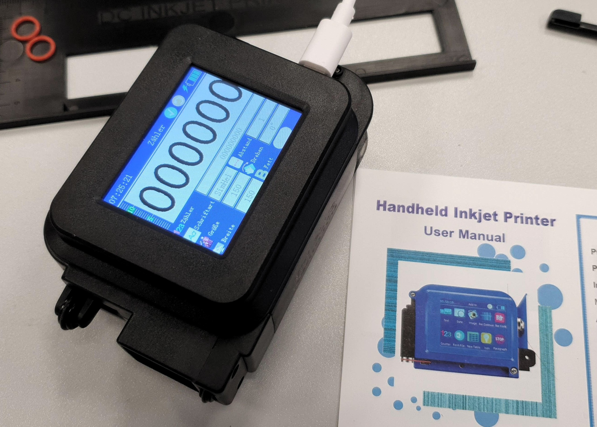

# ZK-Inkjet Printer Reverse Engineering

> Photo gallery: see [**Galllary**](hardware/images/index.md)
  
**Status:** 🚧 Active Analysis | **Chip:** Nuvoton N32903U5DN | **Firmware:** Non-OS / Bare Metal

This repository documents the reverse engineering of the "ZK-1696" class handheld inkjet printers (often sold as **Luqeeg**, **Chiky Tech**, or generic **DP20**). These devices use HP45 (Si) thermal inkjet cartridges to print text, QR codes, and bitmaps on packaging.

The goal is to understand the hardware and firmware well enough to enable **custom automation via USB** (e.g., printing serialized data sent from a PC without manual entry).

---

## 🧩 Project Status

| Component | Status | Notes |
| :--- | :---: | :--- |
| **SoC Identity** | ✅ Verified | **Nuvoton N32903U5DN** (ARM926EJ-S @ 200MHz, 8MB Stacked DDR). |
| **Boot Chain** | ✅ Verified | Proprietary IBR → `BOOT.bin` (RAW Sec 1) → `APP.bin` (RAW Sec 2048). |
| **Update System** | ✅ Verified | **Unsafe.** No CRC/Signature checks. Flashes raw data from SD card. |
| **Pinout** | ✅ Verified | GPIOs mapped. UART console is **blocked** by printhead usage. |
| **UI Decoding** | 🚧 In Progress | 480x480 framebuffer partially decoded (BGR565 scrambled). |
| **USB CDC** | 🔄 Planning | Goal: Add a Virtual Serial Port mode or swap the Mass Storage Class with a Virtual Serial Port class.  |

## 🚴 The "Nerd Cascade"

How we got here:
📉  **Goal:** Label lithium cells for an E-recumbent bike battery.
📉  **Tool:** Bought a cheap handheld inkjet printer.
📉  **Problem:** Manual data entry is tedious.
📉  **Solution:** Reverse engineer the firmware to inject data via USB.
📉  **Reality:** Built custom Ghidra MCP tooling and forced AI agents to read datasheets.
📉  *...the bike is still waiting.*

## 📂 Repository Layout

*   [**hardware/**](hardware/) - PCB analysis, Pinouts, and SoC datasheets.
*   [**firmware/**](firmware/) - Memory maps, Update protocols, and Binary analysis.
*   [**research/**](research/) - Documentation hub, Phase A findings, session logs, and system understanding.
*   [**tools/**](tools/) - Custom Python scripts and utilities.

**📚 Key Documentation:**
*   [**ARCHITECTURE.md**](ARCHITECTURE.md) - System architecture and MCP workflow overview
*   [**HISTORY.md**](HISTORY.md) - Project timeline and major milestones
*   [**research/README.md**](research/README.md) - Research documentation index and Phase A results
*   [**research/system_understanding.md**](research/system_understanding.md) - Comprehensive system reference

## ⚡ Quick Start

**New to this project?** Start here:
1. Read [ARCHITECTURE.md](ARCHITECTURE.md) for system overview
2. Check [research/README.md](research/README.md) for Phase A findings and current status
3. Review [research/phase_a_sd_analysis/SUMMARY.md](research/phase_a_sd_analysis/SUMMARY.md) for latest ground truth

**Prerequisites for development:**
*   Python 3.10+ (for scripts and analysis tools)
*   Ghidra 11.x (for binary analysis via MCP)
*   See [CONTRIBUTING.md](CONTRIBUTING.md) for detailed setup instructions

## ⚠️ Safety Warning

**There are NO SAFETY GUARDS.**
The firmware update mechanism performs **zero** checksum or cryptographic verification. If you flash a corrupted `APP.bin`, the device will brick. Always keep a backup of your SD card image (specifically sectors 0-4096).

## License

*   **Code:** MIT
*   **Documentation/Images:** CC BY 4.0
